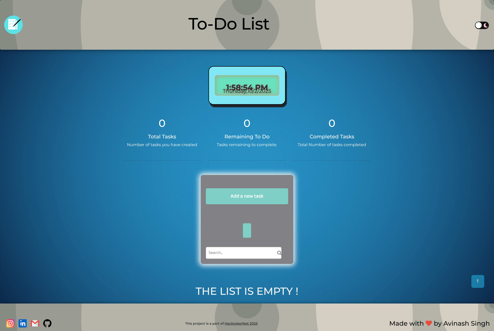

# To-Do-List
This is a simple to-do-list webpage

## Website Link-
 <a href="https://avinash201199.github.io/To-Do-List/">To-Do-List</a>

 ## Table of Contents-
- [How to contribute](#how-to-contribute)
- [Logo](#logo)
- [Screenshots](#screenshots)
- [Technology Stack](#tech_stack)
- [Contributors](#contributors)

# Are you excited to contribute under Hacktoberfest2022?😍

## How to contribute 

- Check [contributing.md file to contribute](https://github.com/avinash201199/To-Do-List/blob/main/CONTRIBUTING.md)
- Star this repository.
- Create an issue with the description of how you want to contribute to this project.
- Wait to be assigned.
- Then fork this repository.
- In the forked repository add your changes.
- Then make a pull request with the issue number.
- Pull request should have a screenshot of the changes you have made.
- Wait for review.

For contributing guidelines and standards, visit [contributing.md](https://github.com/avinash201199/To-Do-List/blob/main/CONTRIBUTING.md)

## 😎 Our Logo 

## 📸 Screenshots 

## Tech Stack 

For any concerns contact me here: -  
 
 (Must Check My Github for more cool stuff !) 

<h2>Project Contributors⭐</h2>

<table align="center">
<tr>
<td>

</td>
</tr>
</table>
### Thank you for your valuable contribution!
