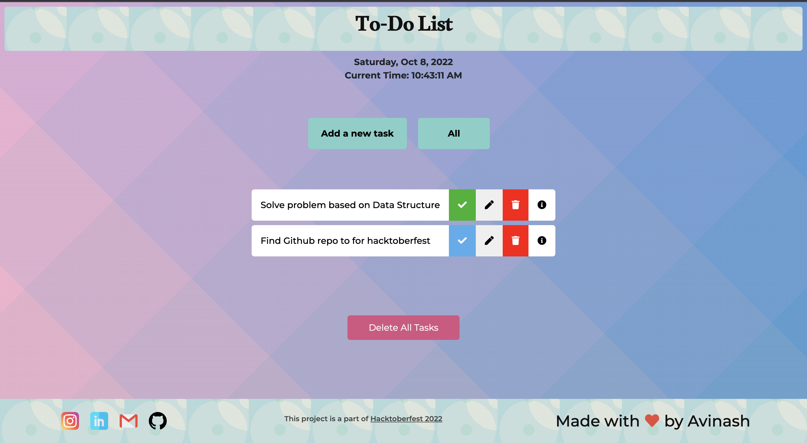
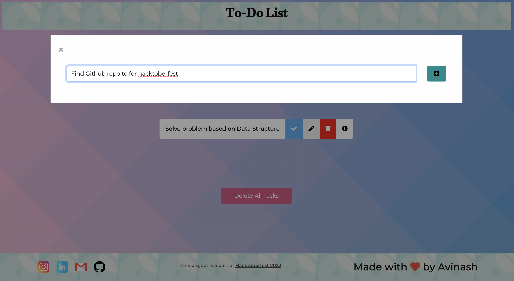
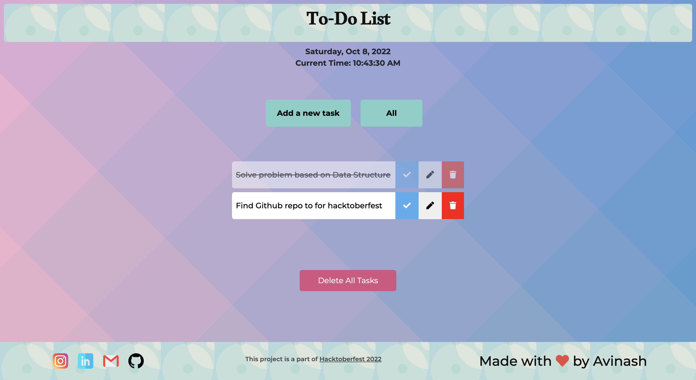
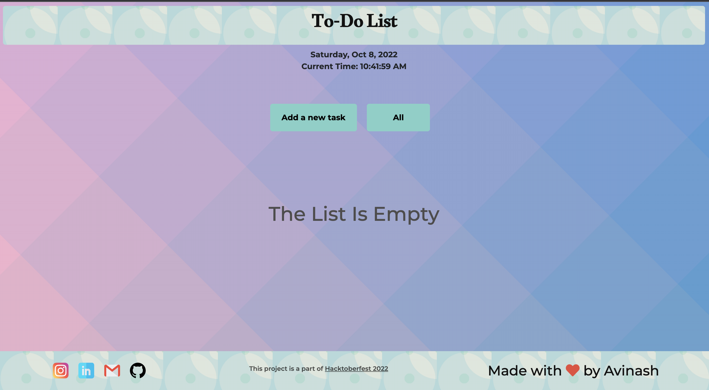

### To-Do-List web link -> https://avinash201199.github.io/To-Do-List/

# Are you excited to contribute under Hacktoberfest2022?😍

## Project Demo 
List view after adding tasks in TO DO List

Add Task

After marked as completed

After deleting all tasks

## Demo video
<video src="assets/videos/project-demo.mp4" data-canonical-src="assets/videos/project-demo.mp4" controls="controls" muted="muted" class="d-block rounded-bottom-2 border-top width-fit" style="max-height:640px;">

</video>

### How to contribute 😎 

* Star this repository.
* Create an issue with description that how you want to contribute in this project.
* Then fork this repository.
* In forked repository add your changes.
* Then make pull request with issue number .
* Pull request should have screenshot of the changes you have made.
* Wait for review.

For any doubt contact me here: -  
 
 (Must Check My Github for more cool stuff !) 
### Thank you for your valuable contribution!
