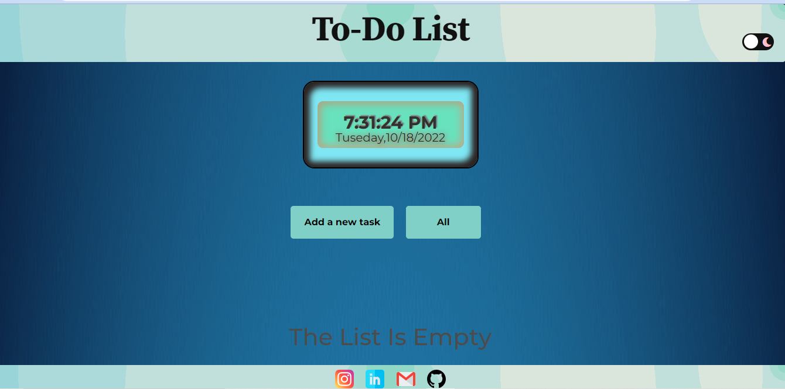

# 📝 To-Do-List


This is a simple to-do-list webpage.

---

## 🌐 Website

[To-Do-List Live Demo](https://avinash201199.github.io/To-Do-List/)

---


## 📑 Table of Contents

- [How to contribute](#-how-to-contribute)
- [Logo](#-our-logo)
- [Screenshots](#-screenshots)
- [Tech Stack](#%EF%B8%8F-tech-stack)
- [Contact](#-contact)
- [Docker Setup](#-docker-setup)
- [Contributors](#project-contributors)

---

## 🎉 Are you excited to contribute under Hacktoberfest2022? 😍

---

## 🤝 How to contribute

- Star this repository.
- Create an issue with the description of how you want to contribute to this project.
- Wait to be assigned.
- Then fork this repository.
- In the forked repository add your changes.
- Then make a pull request with the issue number.
- Pull request should have a screenshot of the changes you have made.
- Wait for review.

For contributing guidelines and standards, visit [contributing.md](https://github.com/avinash201199/To-Do-List/blob/main/CONTRIBUTING.md)


---

## 😎 Our Logo


---

## 📸 Screenshots




---


## 🛠️ Tech Stack

<p align="left">
  <a href="https://developer.mozilla.org/docs/Web/HTML" target="_blank">
    
  </a>
  <a href="https://developer.mozilla.org/docs/Web/CSS" target="_blank">
    
  </a>
  <a href="https://developer.mozilla.org/docs/Web/JavaScript" target="_blank">
    
  </a>
</p>


---

## 📬 Contact


<b>For any concerns, contact me here:</b>

<ul>
  <li>
    <a href="https://www.instagram.com/lets__code/" target="_blank" title="Instagram">
      
      <span style="vertical-align:middle;">@lets__code</span>
    </a>
  </li>
  <li>
    <a href="https://github.com/avinash201199" target="_blank" title="GitHub">
      
      <span style="vertical-align:middle;">avinash201199</span>
    </a>
  </li>
  <li>
    <a href="https://www.linkedin.com/in/avinash-singh-071b79175/" target="_blank" title="LinkedIn">
      
      <span style="vertical-align:middle;">avinash-singh-071b79175</span>
    </a>
  </li>
</ul>

<sub><b>(Must check my GitHub for more cool stuff!)</b></sub>


---

## 🐳 Docker Setup


To run this website in a Docker container, follow these steps:

**Clone this repo:**
```bash
git clone https://github.com/avinash201199/To-Do-List.git
```
**Build the Docker image:**
```bash
docker build -t <your-image-name> .
```

**Run the container:**
```bash
docker run -d -p 8080:80 <your-container-name>
```

You can access your website at: `http://localhost:8080`

<h2>Project Contributors⭐</h2>
<a name = "contributors"></a>
<table align="center">
<tr>
<td>
<a href="https://github.com/avinash201199/To-Do-List/graphs/contributors" align="center">
   
</a>
</td>
</tr>
</table>

### Thank you for your valuable contribution!
